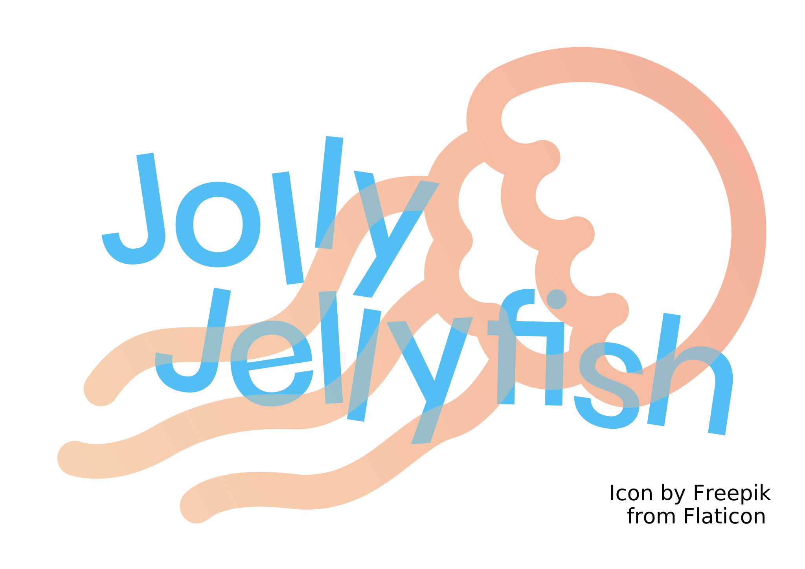

# Jolly Jellyfish


In today's fast moving society, you may want to have your own web property along the information superhighway... 
However, with the latest shutdown of Yahoo!'s Geocities, where to? Don't worry! Halfway™️ has got your back.
Initially named as a joke on Medium, we've expanded into a profitable enterprise.
However, our angel investors did not quite believe us and left us for the next Google...
Now that we're bankrupt, we have a cultural obligation to opensource this.

## Idea

An old-internet style site-creation tool that comes with the kitchen sink.

Simply put, users can choose from a variety of templates and customize it any-which-way.
After this, they can take their site to the forum to get ~~likes~~ feedback.
The most liked sites appear on the front page, along with the most liked users and most recent sites.

## Initial Setup
### Selenium
In order to generate page thumbnails (using `selenium`), a (platform specific) browser driver binary is required (we use the _Chrome/Firefox_ drivers).
Download the image for your Chrome/Firefox version (most likely '_Current stable release_') from here: [Chrome/Chromium][1]; [Firefox][2] 
and set the system environment variable **SELENIUM_DRIVER** to the binary's path. (This is obviously assuming you have Chrome/Firefox installed).

E.g. On Windows (admin) with the chromedriver.exe file, this is done with:
```batch
...\> setx SELENIUM_DRIVER "C:\Path\to\chromedriver.exe" /m
```
(Use `SETENV` command on UNIX)

#### Notes on 'real' distribution
In a production environment, this process would obviously not be needed as the server would be running a known OS.
Therefore, only one executable would need to be download to the src directory and then hard linked within the code; rather than having to use `os.environ`.

Please also note that, as described within `src/page_maker/templatetags/render_thumbnail.py`, 
asynchronous tasks (using `Celery` and `Redis`) are not easily setup on Windows - 
hence this feature can cause loading times of ~5-10 seconds after template and webpage creation forms are initially submitted.
FIXME: find if we can use docker for celery / redis

### Using pipenv
```sh
$ cd src
$ cd jolly-jellyfish
$ pipenv install
$ pipenv shell
(venv) $ python manage.py makemigrations  # TODO: this might be optional, depends on migrations already run.
(venv) $ python manage.py migrate
```

## Usage
```sh
(venv) $ cd src
(venv) $ python manage.py runserver
```

[1]: https://sites.google.com/a/chromium.org/chromedriver/home
[2]: https://github.com/mozilla/geckodriver/releases
